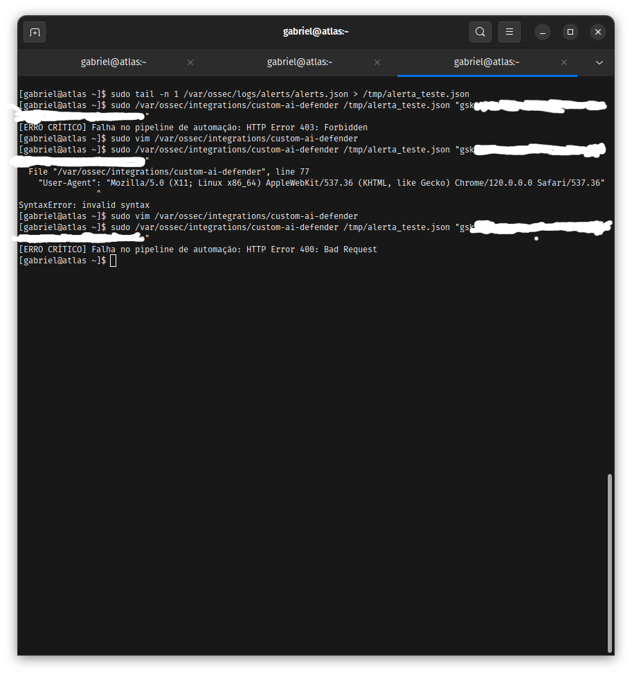

# SOC & Defensive Security Infrastructure (Wazuh SIEM) 🛡️

Repositório dedicado à implementação de monitoramento defensivo, visibilidade centralizada e resposta automatizada a incidentes. Este laboratório documenta a construção de um ecossistema focado em detecção avançada, hardening contínuo e operações Blue Team.

## Business Value & Resiliência
O objetivo principal é garantir uma infraestrutura auditável em tempo real, reduzindo o tempo de resposta a incidentes (MTTR) através de automações de bloqueio e notificações instantâneas de ameaças críticas.

---

# Arquitetura do Laboratório

<pre>
  [Kali Linux] (Simulação de Ataques)
       │
       ▼
[DVWA / Ubuntu 24.04] (Host Real)
       │
       ├───► [Suricata NIDS] (Análise de Tráfego)
       │
       ▼
 [Wazuh Agent] (Coleta de Telemetria / HIDS)
       │
       ▼
 [Wazuh Manager] (Cérebro do SIEM)
       │
  ┌────┴────────────────────────┐
  ▼ (Módulos SOAR / Integrações) ▼
[VirusTotal API]            [Telegram Alerts]
[AbuseIPDB API]             [Active Response (FW-Drop)]
</pre>

---

# Stack Tecnológica & Matriz de Arquitetura SOC

- SIEM/XDR: Wazuh (Manager, Indexer, Dashboard)
- IDS/IPS: Suricata (NIDS), Wazuh Agent (HIDS)
- Sistemas Operacionais: Rocky Linux 9 (Manager), Ubuntu 24.04 LTS (Agent/Host Real) e Kali Linux
- Integrações (SOAR): VirusTotal API, AbuseIPDB API e Telegram Bot API

## Matriz de Capacidades Defensivas

| Camada | Tecnologia | Estratégia de Defesa | Função |
| :--- | :--- | :--- | :--- |
| Centralização de Logs | Wazuh Indexer | Retenção e Indexação | Centralizar e analisar mensagens de logs do ambiente |
| Gestão de Vulnerabilidades | Wazuh SCA | Políticas CIS Benchmarks | Identificar falhas de configuração e checar compliance |
| Detecção de Intrusão | Suricata + Regras Wazuh | Análise de Rede e Host | Detectar tráfego malicioso e anomalias no sistema |
| Inteligência de Ameaças | VirusTotal + AbuseIPDB | Reputação de IPs e Arquivos | Enriquecer alertas com informações externas sobre IPs e hashes |
| Resposta Automática | Módulo Firewall-Drop | Bloqueio Automatizado | Barrar na hora IPs atacantes em tentativas de força bruta |
| Notificação de Incidentes | Telegram Bot | Alertas em Tempo Real | Avisar a equipe de segurança assim que um evento crítico acontece |

---

# 📁 1. Core Deployment & Connectivity

## Contexto
Fase inicial focada em estabelecer e garantir a comunicação segura entre o servidor central (Wazuh Manager) e os sistemas monitorados.

## Troubleshooting — Incompatibilidade de Versões (Version Mismatch)

- Incidente: O agente instalado aparecia como desconectado no painel, mesmo com as portas de rede liberadas.
- Causa raiz: Os logs internos revelaram que o Agent estava rodando em uma versão mais recente (v4.14) do que o Manager (v4.10).
- Resolução: Padronização das versões para garantir total compatibilidade, ajustes de permissões no arquivo de configuração ossec.conf e validação do processo de autenticação via authd.

  
📂 Evidências de Conectividade e Deploy

- Estrutura do Servidor: 
- Erro no Log de Autenticação: 
- Comunicação Restabelecida com Sucesso: 
- Transferência Segura de Arquivos de Configuração: 

### O que aprendi aqui
- Em ambientes SIEM, manter a compatibilidade exata de versões entre agentes e servidores evita falhas de conexão.
- O arquivo ossec.log é sempre o primeiro lugar para olhar quando um agente não quer conectar.
- Mover chaves e arquivos de forma segura usando SCP garante a integridade do deploy desde o início.

---

# 📁 2. Governance & Vulnerability Assessment (SCA)

## Contexto
Fase dedicada a encontrar serviços desnecessários, senhas fracas ou configurações inseguras que poderiam facilitar a entrada de um invasor.

## Estratégia aplicada
Uso do módulo SCA (Security Configuration Assessment) do Wazuh para rodar testes automáticos no sistema baseados no padrão CIS Benchmark. Durante a validação dos scripts de checagem, erros de permissão de leitura nos logs locais foram tratados para garantir que as coletas de auditoria funcionassem sem travar.

  
📂 Evidências de Auditoria e Ajustes de Segurança

- Alertas de Falha de Compliance encontrados pelo SCA: 
- Tratamento de Erro de Permissão de Leitura nos Logs: 
- Sistema Corrigido e Hardening Aplicado com Sucesso: 

### O que aprendi aqui
- Aplicar boas práticas de hardening direto no sistema reduz drasticamente as chances de ataques de movimentação lateral.
- Tratar permissões de scripts de segurança impede que auditorias falhem em silêncio.
- Transformar segurança em métricas visuais facilita o acompanhamento real da postura de defesa da empresa.

---

# 📁 3. Network & Host IDS (Real-Time Detection)

## Estratégia de Defesa em Dupla Camada

### Monitoramento de Rede (NIDS)
Configuração do Suricata focado em analisar o tráfego de rede da placa em tempo real em busca de pacotes suspeitos.

### Monitoramento do Sistema (HIDS)
Monitoramento local com foco em:
- Integridade de Arquivos (FIM) para detectar mudanças em arquivos importantes do sistema.
- Análise de Logs de Autenticação (SSH/PAM) para pegar acessos negados.

  
📂 Evidências de Detecção em Tempo Real

- Alertas gerados pelo tráfego de rede (Suricata): 
- Tentativas de Brute Force pegas no Host (Wazuh Dashboard): 

### O que aprendi aqui
- Combinar o que acontece na rede (NIDS) com o que acontece no servidor (HIDS) traz uma visão muito mais completa do ataque.
- Monitorar a alteração de arquivos de sistema ajuda a descobrir se um invasor tentou deixar um backdoor ou alterar binários.

---

# 📁 4. SOC Automation: Active Response & Threat Intelligence

## Contexto
Ataques automatizados acontecem rápido demais para depender de ação humana manual. Esta etapa foca em programar o sistema para reagir sozinho em segundos.

## Troubleshooting — Problemas com Sintaxe XML e Integração de APIs

### O Problema
O serviço do Wazuh Manager parou de iniciar após a configuração das integrações com as ferramentas de inteligência externas.

### Diagnóstico das Causas Raiz
1. Caracteres invisíveis (Non-breaking spaces) acabaram entrando no arquivo ossec.conf na hora da edição, o que impedia o sistema de ler o arquivo corretamente.
2. Uso de tags que não eram mais suportadas pela API de integração do Wazuh.

### Solução Aplicada
- Limpeza rápida dos caracteres fantasmas no arquivo usando comandos de substituição com o `sed`.
- Correção do bloco `<integration>` removendo os parâmetros inválidos.
- Uso do comando de teste `wazuh-analysisd -t` para checar se o arquivo estava perfeito antes de reiniciar o serviço.

  
📂 Evidências de Automação e Resolução do Erro

- Fluxo de Alerta Completo (Ataque > VirusTotal/AbuseIPDB > Telegram): 
- Arquivo de Configuração Aberto no Vim para Ajustes: 
- Comando de Validação de Sintaxe Apontando o Erro: 
- Identificação da Tag Inválida nos Logs: 
- Status do Serviço Travado Antes da Correção: 
- Ação do Active Response bloqueando IP no Firewall: 

### O que aprendi aqui
- Um único caractere invisível ou tag errada em um arquivo de configuração pode derrubar o sistema de monitoramento inteiro.
- Sempre valide as alterações com ferramentas de teste antes de dar um restart em serviços críticos.
- Automatizar bloqueios de IPs suspeitos reduz o tempo de exposição de forma impressionante.

---

# 📁 5. Adversary Simulation & Web Attack Detection

## Contexto
Testar a eficiência das regras criadas simulando técnicas reais de ataque em um ambiente controlado.

## Testes Realizados no Laboratório

### Ataques Web e Regras Customizadas
Simulação de injeção de código (SQL Injection) contra a aplicação DVWA para checar se as regras do Wazuh correlacionavam o tráfego do Apache corretamente.

### Teste de Força Bruta com Hydra
Disparo de ataques rápidos de dicionário por SSH usando a ferramenta Hydra, validando se o alarme dispararia no bot do Telegram.

### Automação de Rotinas com Cron
Configuração de scripts agendados via crontab para automatizar checagens periódicas de integridade e espaço em disco, registrando alertas sempre que limites de segurança fossem atingidos.

## Validação Prática do Bloqueio Automático

Durante os testes de ataque disparados pelo Kali Linux usando requisições repetidas, a máquina de testes perdeu o acesso ao servidor. Olhando os logs do sistema, foi confirmado que a automação de Resposta Ativa identificou o comportamento nocivo e inseriu o IP na lista de bloqueio do firewall de forma automática.

  
📂 Evidências dos Ataques e Correlação de Eventos

- Logs do Apache registrando os Payloads do ataque sendo detectados: 
- Alertas Críticos chegando no Bot do Telegram no meio do ataque do Hydra: 
- Execução do Script de Auditoria Automatizado pelo Crontab: 

### O que aprendi aqui
- Ver o bloqueio automático funcionando na prática prova o valor de uma estratégia de defesa bem montada.
- Rodar simulações reais de ataque é a única forma de garantir que as suas regras de detecção funcionam de verdade.

---

# Observações Técnicas & Cyber Threat Intelligence

## Sincronização de Tempo (Timestamps)
Durante alguns testes manuais inserindo logs diretamente com o comando `echo`, o motor do Wazuh acabou ignorando os eventos porque os horários do agente e do servidor central estavam desalinhados. Isso me mostrou na prática a importância de ter um servidor NTP bem configurado para manter a linha do tempo dos logs idêntica.

## Próximos Passos com Ferramentas de Inteligência
Em estruturas profissionais de maior porte, as integrações montadas nesse projeto seriam ligadas a plataformas maiores de Threat Intelligence, como o **MISP** ou **Yeti**, permitindo alimentar o SIEM com listas globais e atualizadas de ameaças automaticamente.

---

---

# 📁 6. AI-Powered Incident Response (Wazuh + LLM Integration)

## Contexto
Implementação de uma camada de inteligência sobre o pipeline de alertas. O objetivo é utilizar LLMs para triar incidentes em tempo real, fornecendo diagnóstico imediato e recomendações de remediação enviadas diretamente para o canal operacional (Telegram).

## Troubleshooting — Automação e Ajustes de Performance
Durante o desenvolvimento, enfrentamos desafios críticos de integração que exigiram análise técnica profunda:

- **Resiliência de API:** Erros de requisição (HTTP 400/403) ocorreram devido a mudanças na política de modelos da API. A resolução envolveu a implementação de tratamento de exceções robusto e gestão segura de segredos (Secrets Management), eliminando a exposição de credenciais em logs ou histórico do shell.
- **Tuning de Ruído (Alert Fatigue):** Identificamos um volume excessivo de falsos positivos no alerta `553` (File deleted) durante scans de rede. Realizamos a calibração fina via `local_rules.xml`, filtrando ruídos operacionais e focando a IA apenas em eventos de alta severidade.

  
📂 Evidências do Pipeline de IA

- **Troubleshooting de API:** Erros de pipeline sendo diagnosticados e corrigidos via terminal. 
- **Resposta Inteligente:** Alerta processado pela IA entregue no Telegram com diagnóstico e sugestão de mitigação. 
- **Calibração (Tuning):** Ajuste de regras (`level="0"`) para eliminação de *alert fatigue* e otimização do SOC. 

### O que aprendi aqui
- **Segurança de Pipeline:** A automação deve ser resiliente a erros de API e, acima de tudo, segura. Nunca exponha credenciais em logs ou histórico de comandos.
- **Foco no que importa:** O maior desafio de um SIEM não é detectar tudo, mas filtrar o ruído. O ajuste fino (`tuning`) é o que garante que o analista de segurança não ignore alertas importantes por fadiga operacional.
- **Valor da IA:** A IA no SOC reduz drasticamente o MTTR, transformando um alerta técnico bruto em uma resposta estruturada de negócio.

# Indicadores do Laboratório

| Métrica | Objetivo principal |
| :--- | :--- |
| Tempo de Resposta (MTTR) | Conter a ameaça em milissegundos sem depender de ação humana |
| Visibilidade de Rede | Unificar logs de acessos web com comportamento do sistema operacional |
| Resposta Ativa | Cortar a comunicação de atacantes direto no firewall da máquina afetada |
| Automação de Rotinas | Manter scripts de checagem rodando sozinhos para evitar falhas manuais |

---
