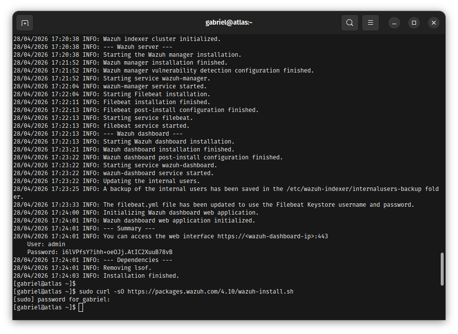
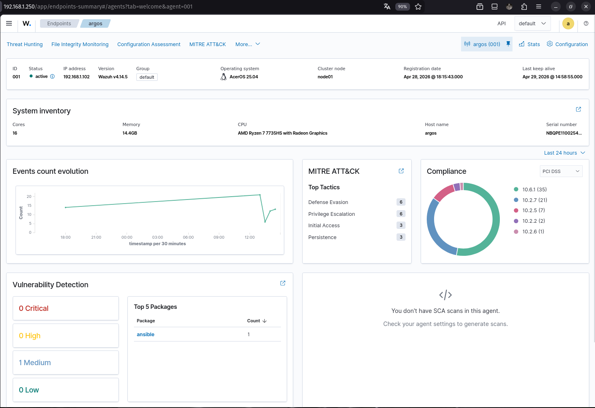
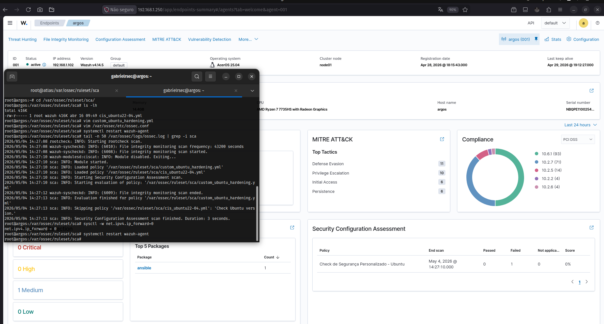
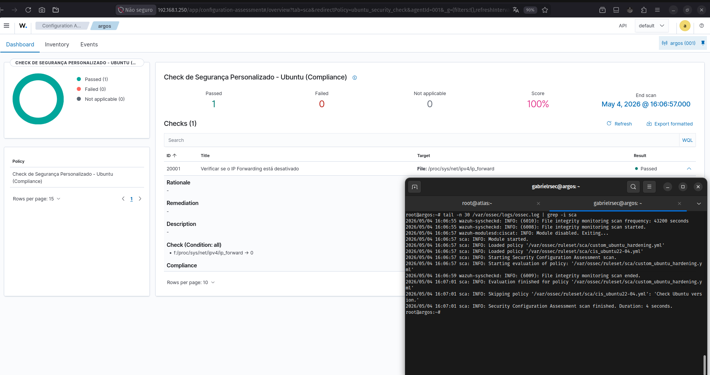

# SOC & Defensive Security Infrastructure (Wazuh SIEM) 🛡️

Repositório dedicado à implementação de monitoramento defensivo, visibilidade centralizada e resposta automatizada a incidentes. Este laboratório documenta a construção de um ecossistema focado em **Detecção Avançada, Hardening Contínuo e Cultura Blue Team**.

## 🎯 Business Value & Resiliência
O objetivo principal é garantir uma infraestrutura auditável em tempo real, reduzindo o **MTTR (Mean Time To Respond)** através de automações de bloqueio e notificações instantâneas de ameaças críticas.

---

## Stack Tecnológica & Matriz de Arquitetura SOC
* **SIEM/XDR:** Wazuh (Manager, Indexer, Dashboard).
* **IDS/IPS:** Suricata (NIDS), Wazuh Agent (HIDS).
* **Sistemas Operacionais:** Rocky Linux 9 (Manager) & Ubuntu 24.04 LTS (Agent/Host Real) & Kali Linux.
* **Integrações (SOAR):** VirusTotal API, Telegram Bot API.

### Matriz de Capacidades Defensivas
| Camada | Tecnologia | Estratégia de Defesa | Função no Ecossistema |
| :--- | :--- | :--- | :--- |
| **Log Management** | Wazuh Indexer | Data Retention / Alert Indexing | Centralização e análise de telemetria |
| **Vulnerability** | Wazuh SCA | Hardening Policies (CIS) | Auditoria de conformidade e falhas de config |
| **Threat Intel** | VirusTotal API | Hash Reputation / Malware Analysis | Alertas com inteligência externa |
| **Active Response** | Firewall-Drop | Automate Ban (IP Tables/NFTables) | Resposta automática a ataques de força bruta |
| **Notification** | Telegram Bot | Real-time Webhook Alerts | Notificação crítica para o time de resposta |

---

## 📁 1. Core Deployment & Hands-on Connectivity

### Contexto do Problema
Resolução de barreiras de comunicação e estabilização do túnel de telemetria entre o cérebro (Manager) e os ativos monitorados.

### Troubleshooting (Post-Mortem: Version Mismatch)
* **Incidente:** Agente reportava status desconectado mesmo com portas 1514/1515 abertas.
* **Causa Raiz:** Investigação de logs revelou incompatibilidade de versão (Manager v4.10 vs Agent v4.14).
* **Resolução:** Padronização das versões, ajuste de permissões de leitura do `ossec.conf` e validação do handshake via `authd`.

  
📂 Visualizar Evidências de Conectividade

  * **Setup do Servidor:** 
  * **Log de Erro (Handshake):** 
  * **Status de Conexão OK:** 

---

## 📁 2. Governance & Vulnerability Assessment (SCA)

### Contexto do Problema
Identificação de "configurações zumbis" e serviços inseguros que aumentam a superfície de ataque lateral.

### Estratégia SRE
Utilização do **SCA (Security Configuration Assessment)** para auditar vetores como IP Forwarding e senhas fracas, transformando conformidade em métrica visual.

  
📂 Visualizar Auditoria de Vulnerabilidades

  * **Inventário de Ativos (Ryzen 7):** 
  * **Detecção de Falha SCA:** 
  * **Compliance 100%:** 

---

## 📁 3. Network & Host IDS (Real-Time Detection)

### Estratégia de Defesa em Camadas
* **NIDS (Network IDS):** Integração com **Suricata** para análise de assinaturas de tráfego malicioso em tempo real.
* **HIDS (Host IDS):** Monitoramento de integridade de arquivos (FIM) e análise de logs de autenticação (PAM/SSH).

  
📂 Visualizar Evidências de Detecção

  * **Detecção de Rede (Suricata):** 
  * **Detecção de Host (Brute Force):** 

---

## 📁 4. SOC Automation: Active Response & Threat Intelligence (SOAR)

### Contexto do Problema
Ataques de força bruta e malwares exigem respostas em milissegundos, superando a velocidade de reação humana.

### Troubleshooting (XML Integrity & Parameter Tuning)
* **Incidente:** Falha crítica no boot do Manager após configuração de APIs externas.
* **Causa Raiz 1 (Sintaxe XML):** Presença de *Non-breaking spaces* (NBSP) no `ossec.conf` (Erro Linha 0). Resolvido via `sed`.
* **Causa Raiz 2 (Incompatibilidade):** Uso de tags inválidas (`alert_only_positive_result`) não suportadas pelo integrador.
* **Resolução:** Limpeza de caracteres invisíveis e refatoração do bloco `<integration>` para o padrão minimalista funcional.

  
📂 Visualizar Evidências de Automação e Resposta

  * **Pipeline Completo (Detecção > VirusTotal > Telegram):** 
  
  * **Investigação de Erro (Parsing XML):** 
  
  * **Identificação de Parâmetro Inválido:** 
  
  * **Log de Sucesso: Active Response (Ban):** 

---

## Roadmap Estratégico

### Fase 01: Core & Audit Foundation
*Foco na estabilização do SIEM e visibilidade inicial.*
- [x] **Setup & Connectivity**: Handshake otimizado entre Manager e Agentes.
- [x] **Vulnerability Management**: Auditoria contínua via SCA e políticas CIS.
- [x] **IDS Foundations**: Implementação de NIDS (Suricata) e HIDS (Wazuh).

### Fase 02: SOC Automation (SOAR)
*Foco em inteligência e resposta automática.*
- [x] **Incident Response**: Bloqueio dinâmico de ameaças (Firewall-Drop).
- [x] **Threat Intelligence**: Enriquecimento de alertas via VirusTotal API.
- [x] **Real-time Notifications**: Transmissão de eventos críticos via Telegram.

### Fase 03: Threat Hunting & Monitoring
*Foco em análise profunda e busca ativa por anomalias.*
- [ ] **Advanced Logging**: Implementação de Sysmon para visibilidade granular de processos.
- [ ] **Malware Hunting**: Criação de regras personalizadas para detecção de persistência.
- [ ] **Security Analytics**: Uso de dashboards avançados para correlação de eventos.

### Fase 04: Cloud & Deception Tactics
*Foco em escalabilidade e táticas de engodo.*
- [ ] **Cloud Security**: Monitoramento de workloads em AWS/Azure.
- [ ] **Deception Tactics**: Implementação de Honeypots integrados para detecção de movimento lateral.

---
> [!IMPORTANT]
> **Lição Aprendida**: A eficiência de um SOC não é medida pela quantidade de alertas, mas pela precisão do diagnóstico e pela velocidade da resposta automatizada. A análise da causa raiz nos logs do Kernel e do SIEM é o que diferencia um instalador de ferramentas de um Analista de Segurança.
